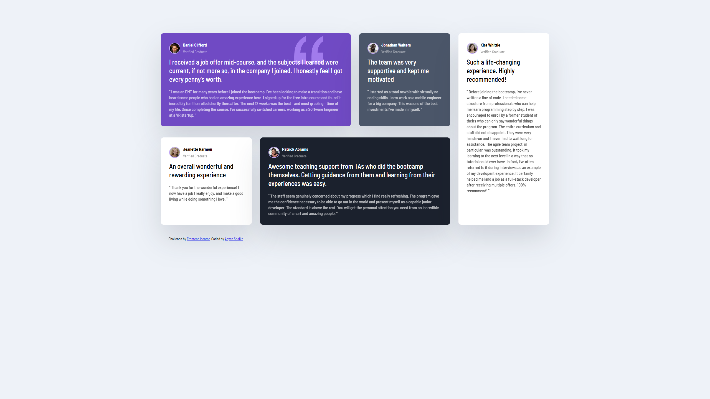

# Frontend Mentor - Testimonials grid section solution

This is a solution to the [Testimonials grid section challenge on Frontend Mentor](https://www.frontendmentor.io/challenges/testimonials-grid-section-Nnw6J7Un7). Frontend Mentor challenges help you improve your coding skills by building realistic projects. 

## Table of contents

- [Overview](#overview)
  - [The challenge](#the-challenge)
  - [Screenshot](#screenshot)
  - [Links](#links)
- [My process](#my-process)
  - [Built with](#built-with)
  - [What I learned](#what-i-learned)
  - [Continued development](#continued-development)
- [Author](#author)
- [Acknowledgments](#acknowledgments)

## Overview

### The challenge

Users should be able to:

- View the optimal layout for the site depending on their device's screen size

### Screenshot

### Links

- Solution URL: [https://www.frontendmentor.io/solutions/testimonials-page-using-css-grid-MJlQ8Ac2kg](https://www.frontendmentor.io/solutions/testimonials-page-using-css-grid-MJlQ8Ac2kg)
- Live Site URL: [https://adyan5786.github.io/Testimonials-Page-using-CSS-Grid/](https://adyan5786.github.io/Testimonials-Page-using-CSS-Grid/)

## My process

### Built with

- Semantic HTML5 markup
- CSS custom properties
- CSS Grid
- Flexbox

### What I learned

I've learned how to use CSS Grid as well as somewhat of Flexbox while coding this project.

### Continued development

CSS in general is something I'm very new to, so I will be mostly focusing more on the CSS side of things while trying to perfect the HTML language.

## Author

- Name - Adyan Shaikh
- Frontend Mentor - [@adyan5786](https://www.frontendmentor.io/profile/adyan5786)

## Acknowledgments

This project was done while learning the CSS Grid Crash Course from Brad Traversy (YouTube Channel: Traversy Media)
